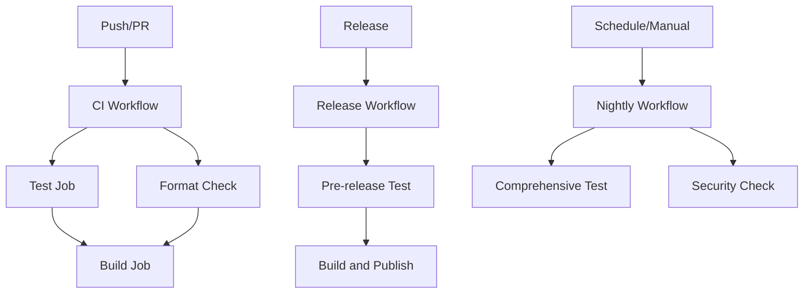

# GitHub Actions Workflows

This directory contains the CI/CD workflows for the FollowWeb Network Analysis Package. All workflows use the unified Python task management system (`tasks.py`) for consistent cross-platform execution.

## Workflow Overview

### `ci.yml` - Continuous Integration
**Triggers:** Push/PR to main/develop branches
- **Matrix Testing:** Python 3.8-3.12 on Ubuntu and Windows
- **Quality Checks:** Linting, type checking, and formatting validation
- **Test Execution:** Full test suite with coverage reporting
- **Build Validation:** Package build verification
- **Performance Testing:** Dedicated performance test job

### `release.yml` - Release Pipeline
**Triggers:** GitHub releases, manual dispatch
- **Pre-release Testing:** Comprehensive testing on multiple platforms
- **Package Building:** Distribution package creation
- **Publishing:** Automated PyPI/Test PyPI publishing
- **Quality Gates:** All tests must pass before publishing

### `nightly.yml` - Nightly Builds
**Triggers:** Daily at 2 AM UTC, manual dispatch
- **Comprehensive Testing:** All platforms (Ubuntu, Windows, macOS)
- **Security Checks:** Dependency vulnerability scanning
- **Dependency Updates:** Check for outdated packages
- **Extended Coverage:** Performance and integration tests

### `docs.yml` - Documentation
**Triggers:** Changes to docs/ or Python files
- **Docstring Coverage:** Validate API documentation completeness
- **Link Validation:** Check for broken documentation links
- **Code Quality:** Scan for TODO/FIXME comments

## Task System Integration

All workflows use cross-platform Python commands that work on both Windows and Unix systems:

```yaml
# Standard test execution
- name: Run tests
  run: |
    python tests/run_tests.py all --cov=FollowWeb_Visualizor --cov-report=
    python -m coverage combine
    python -m coverage xml

# Code quality checks
- name: Run linting
  run: python -m ruff check FollowWeb_Visualizor tests

- name: Run type checking
  run: python -m mypy FollowWeb_Visualizor

# Code formatting
- name: Check formatting
  run: |
    python -m ruff format --check FollowWeb_Visualizor tests
    python -m ruff check FollowWeb_Visualizor tests

# Package building
- name: Build package
  run: python -m build
```

## Matrix Strategy

### Operating Systems
- **Ubuntu Latest:** Primary Linux testing environment
- **Windows Latest:** Windows compatibility validation
- **macOS Latest:** macOS compatibility (nightly only)

### Python Versions
- **Full Matrix (CI):** Python 3.8, 3.9, 3.10, 3.11, 3.12
- **Release Testing:** Python 3.8 (oldest) and 3.12 (newest)
- **Performance:** Python 3.11 (recommended version)

## Exit Code Handling

All workflows rely on the task script exit codes for build status:
- **Exit Code 0:** Success - workflow continues
- **Non-zero Exit Code:** Failure - workflow fails immediately
- **Error Handling:** Clear error messages and recovery suggestions

## Secrets Configuration

Required repository secrets for full functionality:

### PyPI Publishing
- `PYPI_API_TOKEN`: Production PyPI API token
- `TEST_PYPI_API_TOKEN`: Test PyPI API token

### Coverage Reporting
- `CODECOV_TOKEN`: Codecov integration token (optional)

## Workflow Dependencies



## Local Development

Developers can run the same commands locally:

```bash
# Install dependencies
python -m pip install -r requirements.txt
python -m pip install -r requirements-test.txt

# Run the same checks as CI
python -m ruff check FollowWeb_Visualizor tests
python -m mypy FollowWeb_Visualizor
python -m ruff format --check FollowWeb_Visualizor tests
python tests/run_tests.py all --cov=FollowWeb_Visualizor --cov-report=

# Build package
python -m build
```

## Troubleshooting

### Common Issues

1. **Task Script Not Found**
   - Ensure `tasks.py` is in the repository root
   - Check file permissions (should be executable)

2. **Dependency Installation Failures**
   - Verify `requirements.txt` and `requirements-test.txt` exist
   - Check for platform-specific dependency issues

3. **Test Failures**
   - Review test output for specific failure reasons
   - Check if tests pass locally with same Python version

4. **Build Failures**
   - Ensure all dependencies are properly installed
   - Verify package metadata in `setup.py` and `pyproject.toml`

### Debugging Workflows

Enable debug logging by adding to workflow environment:
```yaml
env:
  ACTIONS_STEP_DEBUG: true
  ACTIONS_RUNNER_DEBUG: true
```

## Maintenance

### Adding New Python Versions
1. Update matrix strategy in `ci.yml` and `nightly.yml`
2. Test locally with new Python version
3. Update documentation and requirements if needed

### Modifying Test Strategy
1. Update task commands in workflows
2. Ensure task script supports new options
3. Test changes in feature branch before merging

### Security Updates
1. Regularly update GitHub Actions versions
2. Monitor dependency security alerts
3. Update Python versions as they reach end-of-life