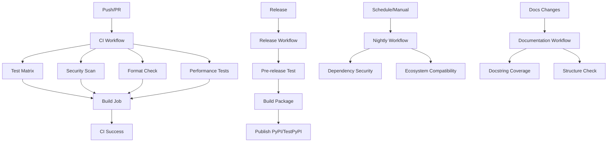

# GitHub Actions Workflows Documentation

This document consolidates all workflow documentation for the FollowWeb Network Analysis Package.

## Table of Contents

1. [Workflow Overview](#workflow-overview)
2. [Schedule Timeline](#schedule-timeline)
3. [Workflow Details](#workflow-details)
4. [CI Helper System](#ci-helper-system)
5. [Matrix Strategy](#matrix-strategy)
6. [Secrets Configuration](#secrets-configuration)
7. [Quick Reference](#quick-reference)
8. [Troubleshooting](#troubleshooting)
9. [Maintenance](#maintenance)

---

## Workflow Overview

All workflows use direct Python commands and the `ci_helpers.py` script for consistent cross-platform execution and status reporting.

### Active Workflows

#### `ci.yml` - Continuous Integration
**Triggers:** Push/PR to main/develop branches, Saturday 2 AM UTC
- **Conventional Commit Validation:** PR title format validation (PRs only)
- **Matrix Testing:** Python 3.9-3.12 on Ubuntu, Windows, and macOS
- **Unit & Integration Tests:** Comprehensive test suite with coverage reporting
- **End-to-End Pipeline Testing:** Full pipeline validation with real data
- **Quality Checks:** Linting, type checking, and formatting validation
- **Security Scanning:** Bandit and pip-audit vulnerability checks
- **Build Validation:** Package build verification and installation testing
- **Performance Testing:** Dedicated performance test job with benchmarking

#### `release.yml` - Release Pipeline
**Triggers:** GitHub releases, manual dispatch
- **Pre-release Testing:** Comprehensive testing on multiple platforms
- **Package Building:** Distribution package creation
- **Publishing:** Automated PyPI/Test PyPI publishing
- **Quality Gates:** All tests must pass before publishing

#### `nightly.yml` - Nightly Dependency & Security Check
**Triggers:** Daily at 2 AM UTC, manual dispatch
- **Security Scanning:** Stricter vulnerability checks (all severity levels)
- **Dependency Updates:** Check for outdated packages and test with latest versions
- **Ecosystem Compatibility:** Test key OS/Python combinations for ecosystem changes
- **Latest Dependency Testing:** Verify compatibility with newest package versions

#### `docs.yml` - Documentation
**Triggers:** Changes to docs/, markdown files, or Python files
- **Docstring Coverage:** Validate API documentation completeness using interrogate
- **Documentation Structure:** Check for required documentation files
- **Code Quality:** Scan for TODO/FIXME comments in source code

#### `freesound-nightly-pipeline.yml` - Freesound Data Collection
**Triggers:** Monday-Saturday at 2 AM UTC, manual dispatch
- **Data Collection:** Collect up to 1,950 Freesound samples daily
- **Network Analysis:** Build and analyze audio similarity networks
- **Visualization:** Generate interactive Sigma.js visualizations
- **Deployment:** Deploy to GitHub Pages
- **Checkpoint Management:** Automatic backup to private repository

#### `freesound-quick-validation.yml` - Quick Validation
**Triggers:** Sunday at 3 AM UTC, manual dispatch
- **Sample Validation:** Validate 300 oldest samples
- **API Health Check:** Verify Freesound API connectivity
- **Data Integrity:** Check for missing or corrupted samples

#### `freesound-full-validation.yml` - Full Validation
**Triggers:** 1st of month at 4 AM UTC, manual dispatch
- **Comprehensive Validation:** Validate all samples in library
- **Data Quality:** Identify and report issues
- **Cleanup:** Remove invalid samples

#### `freesound-metrics-dashboard.yml` - Metrics Dashboard
**Triggers:** Sunday at 5 AM UTC, manual dispatch
- **Metrics Aggregation:** Collect execution metrics
- **Dashboard Generation:** Create visual metrics dashboard
- **Trend Analysis:** Track performance over time

#### `freesound-backup-maintenance.yml` - Backup Maintenance
**Triggers:** Sunday at 6 AM UTC, manual dispatch
- **Backup Cleanup:** Remove old checkpoint backups
- **Storage Management:** Optimize backup repository size
- **Health Check:** Verify backup integrity

---

## Schedule Timeline

### Visual Schedule (UTC)

```
Time    | Mon | Tue | Wed | Thu | Fri | Sat | Sun | Workflow
--------|-----|-----|-----|-----|-----|-----|-----|---------------------------
2:00 AM |  🔵 |  🔵 |  🔵 |  🔵 |  🔵 |  🟢 |     | Freesound Nightly (Mon-Sat)
2:00 AM |     |     |     |     |     |  🟡 |     | CI (Saturday only)
2:00 AM |  🟠 |  🟠 |  🟠 |  🟠 |  🟠 |  🟠 |  🟠 | Nightly Security (Daily)
3:00 AM |     |     |     |     |     |     |  🟣 | Quick Validation (Sunday)
4:00 AM | 1st |     |     |     |     |     |     | Full Validation (Monthly)
5:00 AM |     |     |     |     |     |     |  🔴 | Metrics Dashboard (Sunday)
6:00 AM |     |     |     |     |     |     |  ⚫ | Backup Maintenance (Sunday)
```

**Legend:**
- 🔵 Freesound Nightly Pipeline
- 🟢 CI (Weekly)
- 🟡 CI (Scheduled run)
- 🟠 Nightly Security Check
- 🟣 Quick Validation
- 🔴 Metrics Dashboard
- ⚫ Backup Maintenance

### Schedule Summary Table

| Time | Day     | Workflow           | Duration |
|------|---------|--------------------|----------|
| 2 AM | Sat     | CI                 | 30 min   |
| 2 AM | Daily   | Nightly Security   | 15 min   |
| 2 AM | Mon-Sat | Freesound Nightly  | 120 min  |
| 3 AM | Sun     | Quick Validation   | 30 min   |
| 4 AM | 1st     | Full Validation    | 180 min  |
| 5 AM | Sun     | Metrics Dashboard  | 15 min   |
| 6 AM | Sun     | Backup Maintenance | 10 min   |

---

## Workflow Details

### 1. CI Pipeline (`ci.yml`)
**Schedule:** `0 2 * * 6` (Saturday 2 AM UTC)  
**Duration:** ~30 minutes  
**Purpose:** Weekly comprehensive testing across all OS/Python combinations  
**Concurrency:** Cancel in-progress runs  
**Resource Usage:** High (matrix: 3 OS × 4 Python versions)

**Conflicts:** None (moved from Sunday to Saturday to avoid collision)

---

### 2. Nightly Security Check (`nightly.yml`)
**Schedule:** `0 2 * * *` (Daily 2 AM UTC)  
**Duration:** ~15 minutes  
**Purpose:** Daily dependency and security scanning  
**Concurrency:** Not specified  
**Resource Usage:** Low (single job, ubuntu-latest)

**Conflicts:** 
- Runs same time as Freesound Nightly (Mon-Sat)
- Runs same time as CI (Saturday)
- **Impact:** Minimal - different resource profiles

---

### 3. Freesound Nightly Pipeline (`freesound-nightly-pipeline.yml`)
**Schedule:** `0 2 * * 1-6` (Monday-Saturday 2 AM UTC)  
**Duration:** ~120 minutes (2 hours)  
**Purpose:** Daily Freesound data collection and visualization  
**Concurrency:** No cancel (let complete)  
**Resource Usage:** High (API calls, data processing)

**Conflicts:**
- Runs same time as Nightly Security (Mon-Sat)
- Runs same time as CI (Saturday)
- **Impact:** Moderate - uses different resources (API vs compute)
- **Mitigation:** Workflow orchestration with conflict detection

---

### 4. Quick Validation (`freesound-quick-validation.yml`)
**Schedule:** `0 3 * * 0` (Sunday 3 AM UTC)  
**Duration:** ~30 minutes  
**Purpose:** Weekly validation of 300 oldest samples  
**Concurrency:** No cancel (let complete)  
**Resource Usage:** Low (2 API requests)

**Conflicts:** None  
**Special Logic:** Skips if Full Validation ran same day

---

### 5. Full Validation (`freesound-full-validation.yml`)
**Schedule:** `0 4 1 * *` (1st of month, 4 AM UTC)  
**Duration:** ~180 minutes (3 hours)  
**Purpose:** Monthly validation of all samples  
**Concurrency:** No cancel (let complete)  
**Resource Usage:** Moderate (~27 API requests for 4000 samples)

**Conflicts:** None

---

### 6. Metrics Dashboard (`freesound-metrics-dashboard.yml`)
**Schedule:** `0 5 * * 0` (Sunday 5 AM UTC)  
**Duration:** ~15 minutes  
**Purpose:** Weekly metrics dashboard generation  
**Concurrency:** Not specified  
**Resource Usage:** Low (data aggregation)

**Conflicts:** None

---

### 7. Backup Maintenance (`freesound-backup-maintenance.yml`)
**Schedule:** `0 6 * * 0` (Sunday 6 AM UTC)  
**Duration:** ~10 minutes  
**Purpose:** Weekly backup cleanup and maintenance  
**Concurrency:** Not specified  
**Resource Usage:** Low (API calls to private repo)

**Conflicts:** None

---

## CI Helper System

All workflows use cross-platform Python commands and the `ci_helpers.py` script for consistent status reporting.

### CI Helper Script (`ci_helpers.py`)
The `.github/scripts/ci_helpers.py` script provides:
- **Platform-aware emoji formatting:** Adjusts emoji display based on OS and CI environment
- **Consistent status reporting:** Standardized success, error, and info messages
- **GitHub Actions integration:** Proper formatting for step summaries and annotations
- **Cross-platform compatibility:** Works on Windows, macOS, and Linux CI runners

### Example Usage

```yaml
# Conventional commit validation (PRs only)
- name: Validate conventional commits
  uses: amannn/action-semantic-pull-request@v5
  env:
    GITHUB_TOKEN: ${{ secrets.GITHUB_TOKEN }}

# Standard test execution with coverage
- name: Run tests with coverage
  run: |
    python tests/run_tests.py all --cov=FollowWeb_Visualizor --cov-report=xml --cov-report=term --cov-report=html
    python ../.github/scripts/ci_helpers.py test-summary

# Code quality checks
- name: Run linting
  run: ruff check FollowWeb_Visualizor tests --output-format=github

- name: Run type checking
  run: mypy FollowWeb_Visualizor

# Code formatting
- name: Check formatting
  run: ruff format --check FollowWeb_Visualizor tests --diff

# Package building
- name: Build package
  run: python -m build --sdist --wheel --outdir dist/
```

---

## Matrix Strategy

### Operating Systems
- **Ubuntu Latest:** Primary Linux testing environment
- **Windows Latest:** Windows compatibility validation
- **macOS Latest:** macOS compatibility (nightly only)

### Python Versions
- **Full Matrix (CI):** Python 3.9, 3.10, 3.11, 3.12
- **Release Testing:** Python 3.9 (oldest) and 3.12 (newest)
- **Performance:** Python 3.11 (recommended version)
- **Nightly:** Python 3.9, 3.11, 3.12 (key ecosystem combinations)

### Exit Code Handling

All workflows rely on command exit codes and the `ci_helpers.py` script for build status:
- **Exit Code 0:** Success - workflow continues
- **Non-zero Exit Code:** Failure - workflow fails immediately
- **CI Helper Script:** Provides consistent status reporting and emoji formatting across platforms
- **Error Handling:** Clear error messages and recovery suggestions

---

## Secrets Configuration

Required repository secrets for full functionality:

### PyPI Publishing
- `PYPI_API_TOKEN`: Production PyPI API token
- `TEST_PYPI_API_TOKEN`: Test PyPI API token

### Freesound Integration
- `FREESOUND_API_KEY`: Freesound API key for data collection

### Backup Management
- `BACKUP_PAT`: Personal access token for primary backup repository
- `BACKUP_PAT_SECONDARY`: Personal access token for secondary backup repository

### Coverage Reporting
- `CODECOV_TOKEN`: Codecov integration token (optional)

### API Key Verification

All Freesound workflows validate required secrets before execution:
- Checks for `FREESOUND_API_KEY` presence
- Validates backup tokens if backup is enabled
- Fails fast with clear error messages if secrets are missing

---

## Quick Reference

### Common Commands

#### Trigger Workflows
```bash
gh workflow run ci.yml
gh workflow run freesound-nightly-pipeline.yml
gh workflow run freesound-quick-validation.yml
```

#### Check Workflow Status
```bash
gh run list --workflow=ci.yml --limit 5
gh run view <run-id>
gh run watch <run-id>
```

#### Health Check
```bash
python .github/scripts/workflow_health_check.py --days 7
python .github/scripts/workflow_health_check.py --workflow "CI" --days 30
```

### Local Development

Developers can run the same commands locally (from the `FollowWeb/` directory):

```bash
# Install dependencies
python -m pip install --upgrade pip setuptools wheel
python -m pip install -r requirements-ci.txt -e .

# Run the same checks as CI
ruff check FollowWeb_Visualizor tests --output-format=github
mypy FollowWeb_Visualizor
ruff format --check FollowWeb_Visualizor tests --diff
python tests/run_tests.py all --cov=FollowWeb_Visualizor --cov-report=xml --cov-report=term

# Security checks
bandit -r FollowWeb_Visualizor --severity-level medium
pip-audit --desc

# Build package
python -m build --sdist --wheel --outdir dist/
```

---

## Troubleshooting

### Common Issues

#### 1. CI Helper Script Issues
- Ensure `.github/scripts/ci_helpers.py` exists and is accessible
- Check that FollowWeb_Visualizor package can be imported
- Verify Python path is correctly set

#### 2. Dependency Installation Failures
- Verify `requirements-ci.txt` exists and is up to date
- Check for platform-specific dependency issues
- Ensure Python version compatibility
- Review pip logs for specific errors

#### 3. Test Failures
- Review test output for specific failure reasons
- Check if tests pass locally with same Python version
- Verify test data files are present
- Check for environment-specific issues

#### 4. Build Failures
- Ensure all dependencies are properly installed
- Verify package metadata in `pyproject.toml`
- Check that build artifacts are cleaned before building
- Review build logs for missing files

#### 5. Workflow Failed
- Check logs in Actions tab
- Look for secret validation errors
- Check API quota (Freesound)
- Review recent commits for breaking changes

#### 6. Secret Issues
- `FREESOUND_API_KEY`: Required for Freesound workflows
- `BACKUP_PAT`: Optional, for checkpoint backups
- Verify secrets are set in repository settings
- Check secret names match exactly (case-sensitive)

#### 7. Git Push Failed
- Automatic retry with rebase implemented
- Check for conflicts in logs
- Manual intervention if retry fails
- Verify repository permissions

### Debugging Workflows

Enable debug logging by adding to workflow environment:
```yaml
env:
  ACTIONS_STEP_DEBUG: true
  ACTIONS_RUNNER_DEBUG: true
```

### Emergency Procedures

#### Workflow Stuck/Hanging
1. Check workflow run page for status
2. Cancel run if necessary (Actions tab → Cancel workflow)
3. Check for resource contention or API issues
4. Review logs for timeout or deadlock

#### API Quota Exceeded
1. Check Freesound API dashboard
2. Pause nightly pipeline if needed
3. Wait for quota reset (daily at midnight UTC)
4. Adjust `max_requests` parameter if needed

#### Multiple Workflow Failures
1. Check GitHub Status page
2. Review recent commits for breaking changes
3. Check dependency updates (nightly workflow)
4. Run health check script for patterns

---

## Maintenance

### Resource Usage Patterns

#### Peak Times
- **Saturday 2 AM:** CI + Nightly Security (both lightweight)
- **Monday-Saturday 2 AM:** Freesound Nightly + Nightly Security
- **Sunday 2 AM:** Only Nightly Security (lightest day)

#### API Budget Management
**Freesound API:** 2000 requests/day

| Workflow | Frequency | Requests/Run | Daily Budget |
|----------|-----------|--------------|--------------|
| Nightly Pipeline | Daily (Mon-Sat) | ~1950 | 1950 |
| Quick Validation | Weekly (Sun) | ~2 | 2 |
| Full Validation | Monthly | ~27 | ~1 (amortized) |
| **Total Daily** | - | - | **~1950** |

**Buffer:** 50 requests/day for manual runs and retries

#### GitHub Actions Minutes
Estimated monthly usage (assuming 30-day month):

| Workflow | Runs/Month | Duration | Minutes/Month |
|----------|------------|----------|---------------|
| CI | 4-5 | 30 min × 12 jobs | 1440-1800 |
| Nightly Security | 30 | 15 min | 450 |
| Freesound Nightly | 26 | 120 min | 3120 |
| Quick Validation | 4 | 30 min | 120 |
| Full Validation | 1 | 180 min | 180 |
| Metrics Dashboard | 4 | 15 min | 60 |
| Backup Maintenance | 4 | 10 min | 40 |
| **Total** | - | - | **~5410-5770** |

**Note:** Free tier includes 2000 minutes/month for private repos, 3000 for Pro accounts

### Conflict Resolution Strategy

#### Workflow Orchestration
All Freesound workflows use `WorkflowOrchestrator` to detect and wait for conflicts:
- 2-hour timeout for conflict resolution
- Automatic skip if conflicts persist
- Comprehensive logging

#### Concurrency Groups
```yaml
# Freesound workflows
concurrency:
  group: freesound-pipeline  # or workflow-specific group
  cancel-in-progress: false  # Let validation/data collection complete

# CI workflow
concurrency:
  group: ${{ github.workflow }}-${{ github.ref }}
  cancel-in-progress: true  # Cancel old runs on new commits
```

#### Schedule Staggering
- **2 AM:** High-frequency workflows (daily/weekly)
- **3 AM:** Validation workflows
- **4 AM:** Monthly maintenance
- **5-6 AM:** Reporting and cleanup

### Adding New Python Versions
1. Update matrix strategy in `ci.yml` and `nightly.yml`
2. Test locally with new Python version
3. Update documentation and requirements if needed
4. Update `pyproject.toml` classifiers

### Modifying Test Strategy
1. Update test commands in workflows
2. Ensure `tests/run_tests.py` supports new options
3. Test changes in feature branch before merging
4. Update `ci_helpers.py` if new status reporting is needed

### Security Updates
1. Regularly update GitHub Actions versions (automated via Dependabot)
2. Monitor dependency security alerts
3. Update Python versions as they reach end-of-life
4. Review and merge Dependabot PRs promptly

### Automated Dependency Management

#### Dependabot Configuration (`dependabot.yml`)
Automated dependency updates are managed through Dependabot:
- **Python Dependencies:** Weekly updates on Mondays for pip packages in `/FollowWeb`
- **GitHub Actions:** Weekly updates on Mondays for action versions
- **Pull Request Limits:** 10 for Python deps, 5 for GitHub Actions
- **Auto-labeling:** Dependencies are automatically labeled and assigned

### Optimization Opportunities

#### Immediate
- ✅ Schedule collision fixed (CI moved to Saturday)
- ✅ Artifact naming fixed (unique names per matrix job)
- ✅ Secret validation added (fail fast)

#### Short-term
- [ ] Add workflow duration tracking to detect performance regressions
- [ ] Implement API quota monitoring with alerts
- [ ] Add failure notifications (Slack/email)

#### Long-term
- [ ] Consider reusable workflows to reduce duplication
- [ ] Implement smart scheduling based on historical patterns
- [ ] Add cost monitoring dashboard

### Monitoring and Alerts

#### Health Checks
Use the workflow health check script:
```bash
# Generate health report for last 30 days
python .github/scripts/workflow_health_check.py --days 30 --output health_report.md

# Check specific workflow
python .github/scripts/workflow_health_check.py --workflow "CI" --days 7
```

#### Key Metrics to Monitor
- Success rate per workflow (target: >95%)
- Average duration (detect regressions)
- Failure patterns (time of day, specific jobs)
- API quota usage (Freesound)
- GitHub Actions minutes usage

---

## Workflow Dependencies



---

## Change Log

### 2024-11-13
- Consolidated workflow documentation into single WORKFLOWS.md file
- Merged README.md, QUICK_REFERENCE.md, and SCHEDULE_OVERVIEW.md
- Removed API_KEY_VERIFICATION.md (empty file)
- Improved navigation with table of contents
- Enhanced troubleshooting section

### 2024-11-12
- Fixed schedule collision: CI moved from Sunday to Saturday
- Added secret validation to all Freesound workflows
- Improved git push error handling with retry logic
- Created comprehensive documentation

### Future Updates
- Document any schedule changes here
- Note new workflows or removed workflows
- Track optimization implementations

---

## Additional Resources

- **Requirements Guide:** `FollowWeb/REQUIREMENTS_GUIDE.md`
- **Installation Guide:** `FollowWeb/INSTALL_GUIDE.md`
- **Main Documentation:** `Docs/README.md`
- **Pipeline Documentation:** `Docs/FREESOUND_PIPELINE.md`
- **CI Helper Script:** `.github/scripts/ci_helpers.py`
- **Workflow Health Check:** `.github/scripts/workflow_health_check.py`
