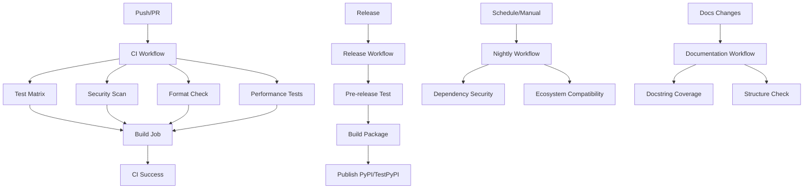

# GitHub Actions Workflows

This directory contains the CI/CD workflows for the FollowWeb Network Analysis Package. All workflows use direct Python commands and the `ci_helpers.py` script for consistent cross-platform execution and status reporting.

## Workflow Overview

### `ci.yml` - Continuous Integration
**Triggers:** Push/PR to main/develop branches
- **Conventional Commit Validation:** PR title format validation (PRs only)
- **Matrix Testing:** Python 3.9-3.12 on Ubuntu, Windows, and macOS
- **Unit & Integration Tests:** Comprehensive test suite with coverage reporting
- **End-to-End Pipeline Testing:** Full pipeline validation with real data
- **Quality Checks:** Linting, type checking, and formatting validation
- **Security Scanning:** Bandit and pip-audit vulnerability checks
- **Build Validation:** Package build verification and installation testing
- **Performance Testing:** Dedicated performance test job with benchmarking

### `release.yml` - Release Pipeline
**Triggers:** GitHub releases, manual dispatch
- **Pre-release Testing:** Comprehensive testing on multiple platforms
- **Package Building:** Distribution package creation
- **Publishing:** Automated PyPI/Test PyPI publishing
- **Quality Gates:** All tests must pass before publishing

### `nightly.yml` - Nightly Dependency & Security Check
**Triggers:** Daily at 2 AM UTC, manual dispatch
- **Security Scanning:** Stricter vulnerability checks (all severity levels)
- **Dependency Updates:** Check for outdated packages and test with latest versions
- **Ecosystem Compatibility:** Test key OS/Python combinations for ecosystem changes
- **Latest Dependency Testing:** Verify compatibility with newest package versions

### `docs.yml` - Documentation
**Triggers:** Changes to docs/, markdown files, or Python files
- **Docstring Coverage:** Validate API documentation completeness using interrogate
- **Documentation Structure:** Check for required documentation files
- **Code Quality:** Scan for TODO/FIXME comments in source code

## CI Helper System Integration

All workflows use cross-platform Python commands and the `ci_helpers.py` script for consistent status reporting:

### CI Helper Script (`ci_helpers.py`)
The `.github/scripts/ci_helpers.py` script provides:
- **Platform-aware emoji formatting:** Adjusts emoji display based on OS and CI environment
- **Consistent status reporting:** Standardized success, error, and info messages
- **GitHub Actions integration:** Proper formatting for step summaries and annotations
- **Cross-platform compatibility:** Works on Windows, macOS, and Linux CI runners

```yaml
# Conventional commit validation (PRs only)
- name: Validate conventional commits
  uses: amannn/action-semantic-pull-request@v5
  env:
    GITHUB_TOKEN: ${{ secrets.GITHUB_TOKEN }}

# Standard test execution with coverage
- name: Run tests with coverage
  run: |
    python tests/run_tests.py all --cov=FollowWeb_Visualizor --cov-report=xml --cov-report=term --cov-report=html
    python ../.github/scripts/ci_helpers.py test-summary

# Code quality checks
- name: Run linting
  run: ruff check FollowWeb_Visualizor tests --output-format=github

- name: Run type checking
  run: mypy FollowWeb_Visualizor

# Code formatting
- name: Check formatting
  run: ruff format --check FollowWeb_Visualizor tests --diff

# Package building
- name: Build package
  run: python -m build --sdist --wheel --outdir dist/
```

## Matrix Strategy

### Operating Systems
- **Ubuntu Latest:** Primary Linux testing environment
- **Windows Latest:** Windows compatibility validation
- **macOS Latest:** macOS compatibility (nightly only)

### Python Versions
- **Full Matrix (CI):** Python 3.9, 3.10, 3.11, 3.12
- **Release Testing:** Python 3.9 (oldest) and 3.12 (newest)
- **Performance:** Python 3.11 (recommended version)
- **Nightly:** Python 3.9, 3.11, 3.12 (key ecosystem combinations)

## Exit Code Handling

All workflows rely on command exit codes and the `ci_helpers.py` script for build status:
- **Exit Code 0:** Success - workflow continues
- **Non-zero Exit Code:** Failure - workflow fails immediately
- **CI Helper Script:** Provides consistent status reporting and emoji formatting across platforms
- **Error Handling:** Clear error messages and recovery suggestions

## Secrets Configuration

Required repository secrets for full functionality:

### PyPI Publishing
- `PYPI_API_TOKEN`: Production PyPI API token
- `TEST_PYPI_API_TOKEN`: Test PyPI API token

### Coverage Reporting
- `CODECOV_TOKEN`: Codecov integration token (optional)

## Workflow Dependencies



## Local Development

Developers can run the same commands locally (from the `FollowWeb/` directory):

```bash
# Install dependencies
python -m pip install --upgrade pip setuptools wheel
python -m pip install -r requirements-ci.txt -e .

# Run the same checks as CI
ruff check FollowWeb_Visualizor tests --output-format=github
mypy FollowWeb_Visualizor
ruff format --check FollowWeb_Visualizor tests --diff
python tests/run_tests.py all --cov=FollowWeb_Visualizor --cov-report=xml --cov-report=term

# Security checks
bandit -r FollowWeb_Visualizor --severity-level medium
pip-audit --desc

# Build package
python -m build --sdist --wheel --outdir dist/
```

## Troubleshooting

### Common Issues

1. **CI Helper Script Issues**
   - Ensure `.github/scripts/ci_helpers.py` exists and is accessible
   - Check that FollowWeb_Visualizor package can be imported

2. **Dependency Installation Failures**
   - Verify `requirements-ci.txt` exists and is up to date
   - Check for platform-specific dependency issues
   - Ensure Python version compatibility

3. **Test Failures**
   - Review test output for specific failure reasons
   - Check if tests pass locally with same Python version
   - Verify test data files are present

4. **Build Failures**
   - Ensure all dependencies are properly installed
   - Verify package metadata in `pyproject.toml`
   - Check that build artifacts are cleaned before building

### Debugging Workflows

Enable debug logging by adding to workflow environment:
```yaml
env:
  ACTIONS_STEP_DEBUG: true
  ACTIONS_RUNNER_DEBUG: true
```

## Automated Dependency Management

### Dependabot Configuration (`dependabot.yml`)
Automated dependency updates are managed through Dependabot:
- **Python Dependencies:** Weekly updates on Mondays for pip packages in `/FollowWeb`
- **GitHub Actions:** Weekly updates on Mondays for action versions
- **Pull Request Limits:** 10 for Python deps, 5 for GitHub Actions
- **Auto-labeling:** Dependencies are automatically labeled and assigned

## Maintenance

### Adding New Python Versions
1. Update matrix strategy in `ci.yml` and `nightly.yml`
2. Test locally with new Python version
3. Update documentation and requirements if needed

### Modifying Test Strategy
1. Update test commands in workflows
2. Ensure `tests/run_tests.py` supports new options
3. Test changes in feature branch before merging
4. Update `ci_helpers.py` if new status reporting is needed

### Security Updates
1. Regularly update GitHub Actions versions (automated via Dependabot)
2. Monitor dependency security alerts
3. Update Python versions as they reach end-of-life
4. Review and merge Dependabot PRs promptly